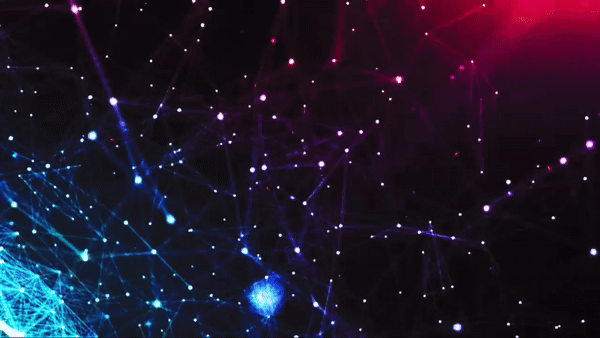

# OVL-MD Bot

## 🌟 Description

Bienvenue sur OVL-MD, votre compagnon numérique idéal pour WhatsApp ! Ce bot polyvalent a été conçu pour rendre votre expérience de chat plus agréable et interactive. Que vous souhaitiez écouter de la musique, télécharger vos vidéos préférées, ou simplement vous amuser avec des fonctionnalités innovantes, OVL-MD est là pour répondre à tous vos besoins.

## 🎉 Fonctionnalités

Découvrez tout ce que OVL-MD peut vous offrir :

- **Téléchargement de Musique** 🎵 :
  - Recherchez et obtenez vos titres préférés directement depuis YouTube, sans tracas.

- **Téléchargement de Vidéos** 🎥 :
  - Téléchargez des vidéos à partir de YouTube en utilisant simplement un lien ou en effectuant une recherche.

- **Commandes Interactives** 🛠️ :
  - Interagissez facilement avec le bot à travers des commandes simples et intuitives.

- **Support de Proxy** 🌐 :
  - Utilisez un proxy pour accéder à YouTube si nécessaire, sans complications.

## 🚀 Déploiement

Pour héberger OVL-MD, nous recommandons **Render**. Vous pouvez également consulter le scan de la session ci-dessous :

 

## 🤝 Contributions

Les contributions sont les bienvenues ! Si vous avez des idées pour améliorer le bot ou si vous souhaitez corriger des bogues, n'hésitez pas à soumettre une demande de tirage (pull request).

## 📄 License

Ce projet est sous la licence MIT. Consultez le fichier LICENSE pour plus de détails.
